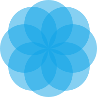

  

# SereneBreath

[SereneBreath.com](https://serenebreath.com) is a small webapp to help you improve your breathing, relaxing and managing your stress.

## Stack

- TypeScript
- React
- React Spring
- Tailwind
- Storybook
- Vite
- Vitest
- Vercel

## Credits

[Breathly](https://github.com/mmazzarolo/breathly-app) was the greatest inspiration to this app. The features and interface are very similar, and the english lines are the same.

I bought the portuguese lines on fiverr.com. The female voice is from [Marlou Nobre](https://fiverr.com/marlou_nobre) and the male voice is still not available.

<a href="https://www.freepik.com/free-psd/digital-devices-screen-editable_16303836.htm#query=device%20mockup&position=1&from_view=keyword&track=ais">Mockup image by rawpixel.com</a> on Freepik.

## Contributions

Contributions are welcome, specially translations. The issues are open for suggestions, bug reports and discussions.
